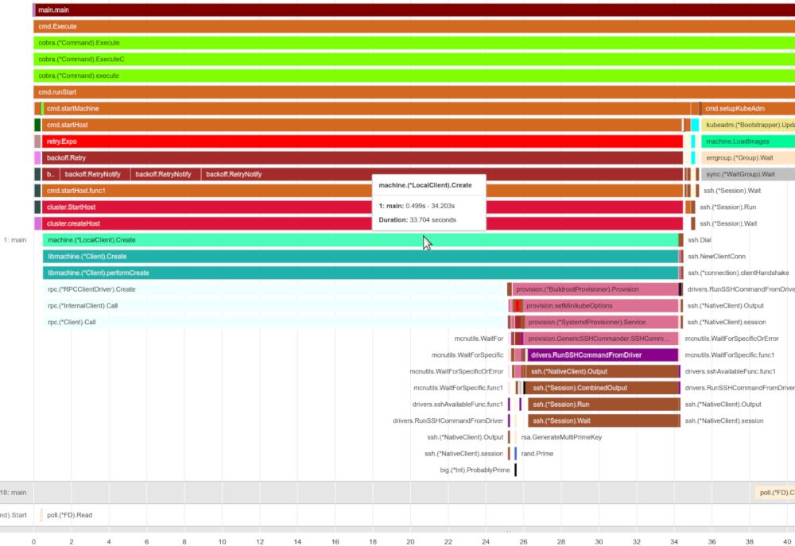

# slowjam

Wall-clock performance analysis of Go applications using stack-sampling.

*Written for the Cloud Code December 2019 Hackathon!*

## Overview

SlowJam is a tool for analyzing the performance of Go applications which consume substantial wall-clock time, but do not consume substantial CPU time. For example, an automation tool which primarily waits on command-line execution or remote resources to become available.

Go has great profiling and tracing support for applications which consume many resources, but does not have a low-touch story for profiling applications that primarily wait on external resources.

### Novel features:

* Stack-based sampling approach
* Minimal instrumentation (2 lines of code to integrate)
* Minimal & tunable overhead (~1%)
* Hybrid Gantt/Flamegraph visualization

## Example

minikube analysis: https://tstromberg.users.x20web.corp.google.com/www/slowjam-minikube.html



## Usage

Add a line to your code, preferably guarded by a flag due to the performance overhead:

```
s, err := stacklog.Start()
defer s.Stop()
```

Generate a timeline graph:

```
go run cmd/timeline stack.log
```

## Checking out the code

```
glogin || prodaccess
git clone git clone sso://user/tstromberg/slowjam
```

## Can I use it with Go modules?

No. Go modules are incompatible with Git-On-Borg. See: https://user.git.corp.google.com/masayasuzuki/mathbin/

## Are you going to open-source this?

See proposal for open-sourcing slowjam: http://go/slowjam-oss


